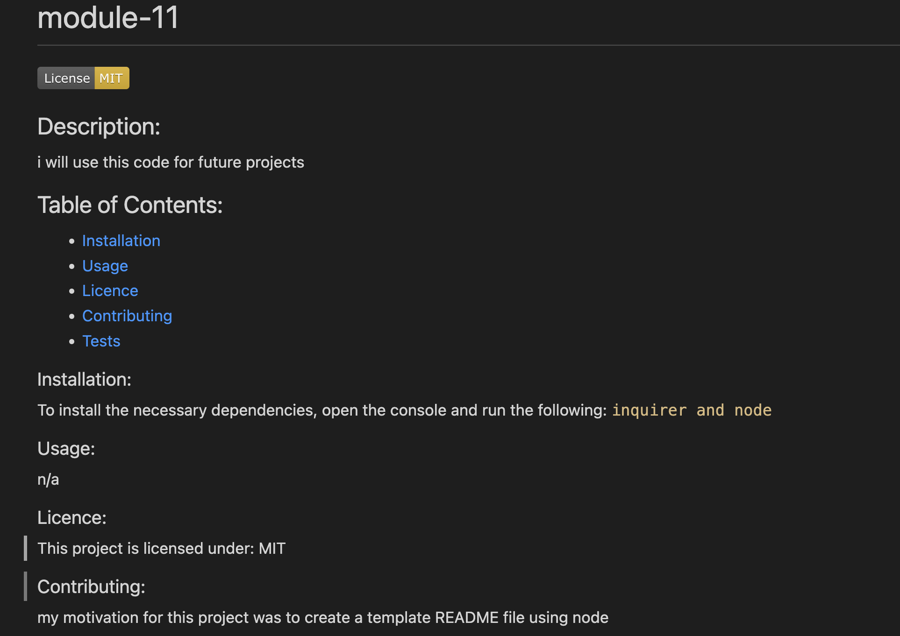

# Module 11 Challenge: Professional README Generator

## Your Task

When creating an open source project on GitHub, it’s important to have a high-quality README for the app. This should include what the app is for, how to use the app, how to install it, how to report issues, and how to make contributions—this last part increases the likelihood that other developers will contribute to the success of the project. 

You can quickly and easily create a README file by using a command-line application to generate one. This allows the project creator to devote more time to working on the project.

Your task is to create a command-line application that dynamically generates a professional README.md file from a user's input using the [Inquirer package](https://www.npmjs.com/package/inquirer). Review the [Good README Guide](../../01-HTML-Git-CSS/04-Important/Good-README-Guide/README.md) as a reminder of everything that a high-quality, professional README should contain. 
 
The application will be invoked by using the following command:

```bash
node index.js
```
I installed inquirer 6.5.0 version prior to starting this project
```bash
npm i inquirer@6.5.0
```

## Table of Contents
- [User Story](#user-story)
- [Video Demo](#video-demo)
- [Terminal](#terminal)
- [Final result](#final-result)

## User Story

As a developer, I want a README generator so that I can quickly and easily create a professional README for a new project. This will be a great time saver for future projects and it will also have a layout so it ensures i include all the necessary information about the project. 

## Video Demo
Below is a video walk through demonstrating the functionality of the application.

[Video walk through](https://drive.google.com/file/d/1HsHDSJKiPuAhNB0a73UPpQZodBowI-Le/view)


## Terminal

Below is a screenshot of the terminal. It shows all the questions the user has to input to enable the README file. 


## Final Result

This is the final result that is displayed once all questions have been answered. 



## GitHub 
[GitHub](https://github.com/bex-ford/module-11)